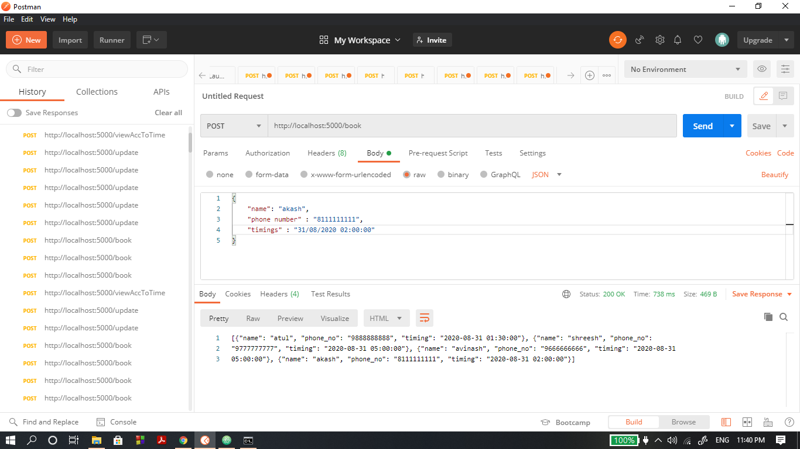
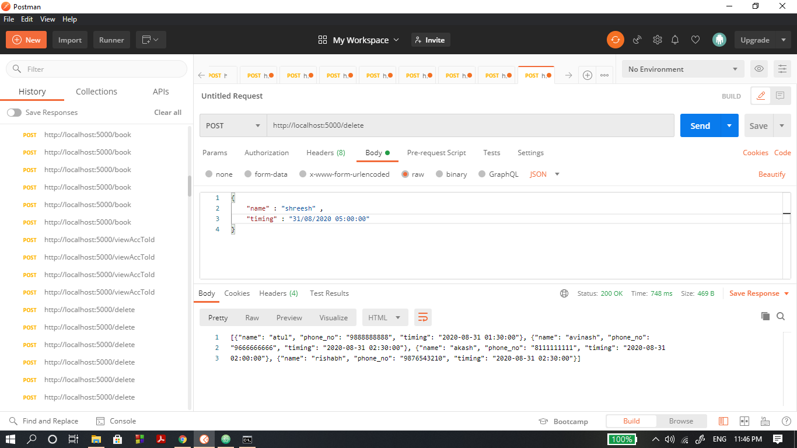

# Movie-Tickets-Booking-System 


### About

A flask based REST interface for a movie theatre ticket booking system.


## Endpoints

1. **'/book'** - An endpoint to book a ticket using a user’s name, phone number, and timings.  
**input** - in JSON format  
```
{
    "name": "akash",
    "phone number" : "8111111111",
    "timings" : "31/08/2020 02:00:00" 
}
```  


2. **'/update'** - An endpoint to update a ticket timing.  
**input** - in JSON format  
```
{
    "id": "9",
    "newtime" : "31/08/2020 02:30:00" 
}
```  


3. **'/viewAccToTime'** - An endpoint to view all the tickets for a particular time.  
**input** - in JSON format
```
{
    "timing" : "31/08/2020 02:30:00" 
}
```


4. **'/delete'** - An endpoint to delete a particular ticket.  
**input** - in JSON format
```
{
    "name" : "shreesh" ,
    "timing" : "31/08/2020 05:00:00" 
}
```  


5. **'/viewAccToId'** - An endpoint to view the user’s details based on the ticket id.  
**input** - in JSON format
```
{
    "id" : "9" 
}
```

### Ticket expires if diff. between booking time and current time is 8 hours and record is deleted
* ticket timing initially set for diff. of less than 8 hours

* updated, diff. is more than 8, therefore ticket expired

### More than 20 pepople are not allowed at the same time


## Databse used
MYSQL

## HOW TO RUN 
Download the Postman application on your device, its is a software development tool. It enables people to test calls to APIs.    
**You can** ***also*** **make a virtual environment if any of the packages collide with working of any other project of yours.**  
1. install virtualenv
```
pip install virtualenv
```
2. create a virtual environment
```
python -m virtualenv demoEnv
```
3. Activate the environment
```
demoEnv\Scripts\activate
```
4. To deactivate
```
deactivate
```
Install the ***requirements.txt*** file in the repository, using the following command on command prompt.
```
pip install -r requirements.txt
```

Its a flask based API.  
  
Once you have installed all the packages or files.
Install MYSQL, Setup your MYSQL database after loging into mysql using the following commands on your cmd
```
C:Users\abcd\desktop\project> mysql -u root -p
C:Users\abcd\desktop\project> enter the password: *********
mysql>> create database dbname;
mysql>> use dbname;
``` 
Run the ***app.py*** file by using the following cmd command.
```
python app.py
```
Then, when the server runs successfully. Copy the the localhost URL to the Postman Application and paste the URL in the URL section and pass the information in JSON format(as shown above) using the ***raw*** option in the ***Body*** option. 
 
You'll see the output in the Response frame.

## Contributing
Pull requests are welcome. For major changes, please open an issue first to discuss what you would like to change.

Please make sure to update tests as appropriate.

